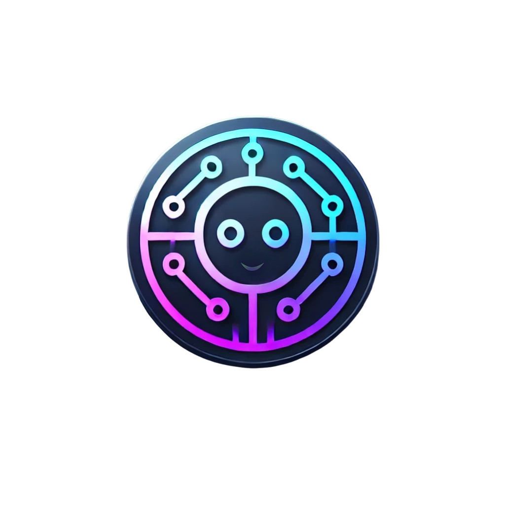

# TechTrendGPT 🤖

<div align="center">
  
  <br/>
  <p>
    <strong>An RAG-based chatbot specializing in technology discussions and real-time tech news updates</strong>
  </p>
</div>

## 📋 Table of Contents
- [Overview](#overview)
- [Features](#features)
- [Architecture](#architecture)
- [Tech Stack](#tech-stack)
- [RAG Implementation](#rag-implementation)
- [Prerequisites](#prerequisites)
- [Installation](#installation)
- [Environment Variables](#environment-variables)
- [Project Structure](#project-structure)
- [Key Components](#key-components)
- [API Integration](#api-integration)
- [Scheduled Updates](#scheduled-updates)
- [Contributing](#contributing)

## 📝 Overview

TechTrendGPT is a sophisticated chatbot that combines Retrieval-Augmented Generation (RAG) with real-time tech news updates to provide accurate, context-aware responses about technology trends and developments. The system uses a vector database to store and retrieve relevant information, ensuring responses are both accurate and up-to-date.

## ✨ Features

### Core Features
- 🔍 RAG (Retrieval-Augmented Generation) for accurate, context-aware responses
- 💬 Real-time chat interface with AI responses
- 📱 Fully responsive design for mobile and desktop
- 🔄 Stream-based responses for smooth interaction
- 📰 Integration with NewsAPI for real-time tech news
- 💡 Smart prompt suggestions for quick interactions
- 🎨 Modern UI with dark mode support
- ⌨️ Markdown support for formatted responses
- 🔗 Clickable links with proper formatting
- 📜 Auto-scrolling with manual override capability

### Advanced Features
- 🕒 Time-sensitive query handling
- 📚 Evergreen content management
- 🔄 Automatic content updates
- 🎯 Context-aware response generation
- 📊 Vector similarity search
- 🔄 Streaming response support
- 📱 Mobile-optimized formatting
  


## 🏗️ Architecture

### System Components
1. **Frontend Layer**
   - Next.js 13+ with App Router
   - React components for UI
   - Real-time streaming support
   - Responsive design system

2. **Backend Layer**
   - OpenAI GPT-4 integration
   - LangChain for RAG implementation
   - Vector database (Astra DB)
   - NewsAPI integration

3. **Data Layer**
   - Vector embeddings storage
   - Content chunking system
   - Real-time news updates
   - Context management

### Data Flow
1. User query → Embedding generation
2. Vector similarity search → Context retrieval
3. Context + News → Response generation
4. Streaming response → User interface

## 🛠️ Tech Stack

### Frontend
- **Framework**: Next.js 13+ with App Router
- **Language**: TypeScript
- **UI Components**: Custom React components
- **State Management**: React Hooks
- **Styling**: CSS-in-JS with styled-jsx

### Backend
- **AI Integration**: 
  - OpenAI GPT-4
  - LangChain for RAG
  - text-embedding-ada-002 for embeddings
- **Database**: Astra DB (Vector Database)
- **News Integration**: NewsAPI
- **API Handling**: Axios

## 🔍 RAG Implementation

### Vector Database Setup
- Database: Astra DB
- Embedding Model: text-embedding-ada-002
- Vector Dimension: 1536
- Similarity Metric: dot_product

### Content Processing
- Chunk Size: 512 tokens
- Chunk Overlap: 100 tokens
- Content Sources: 40+ tech websites and blogs
- Update Frequency: Daily

### Query Processing
1. **Query Analysis**
   - Time-sensitivity detection
   - Context type determination
   - Keyword extraction

2. **Context Retrieval**
   - Vector similarity search
   - Time-based filtering
   - Relevance scoring

3. **Response Generation**
   - Context integration
   - News integration
   - Format optimization

## ⚙️ Prerequisites

Before you begin, ensure you have the following installed:
- Node.js 16.x or later
- npm or yarn
- OpenAI API key
- NewsAPI key
- Astra DB account and credentials

## 🚀 Installation

1. **Clone the repository**
   ```bash
   git clone https://github.com/yourusername/techtrendgpt.git
   cd techtrendgpt
   ```

2. **Install dependencies**
   ```bash
   npm install
   # or
   yarn install
   ```

3. **Set up environment variables**
   Create a `.env.local` file in the root directory with your API keys:
   ```env
   OPENAI_API_KEY=your_openai_api_key_here
   NEWS_API_KEY=your_newsapi_key_here
   ASTRA_DB_NAMESPACE=your_namespace
   ASTRA_DB_COLLECTION=your_collection
   ASTRA_DB_API_ENDPOINT=your_endpoint
   ASTRA_DB_APPLICATION_TOKEN=your_token
   ```

4. **Initialize the database**
   ```bash
   npm run seed
   # or
   yarn seed
   ```

5. **Start the development server**
   ```bash
   npm run dev
   # or
   yarn dev
   ```

6. **Access the application**
   Open [http://localhost:3000](http://localhost:3000) in your browser

## 🔑 Environment Variables

| Variable | Description | Required |
|----------|-------------|----------|
| `OPENAI_API_KEY` | Your OpenAI API key | Yes |
| `NEWS_API_KEY` | Your NewsAPI key | Yes |
| `ASTRA_DB_NAMESPACE` | Your Astra DB namespace | Yes |
| `ASTRA_DB_COLLECTION` | Your collection name | Yes |
| `ASTRA_DB_API_ENDPOINT` | Your Astra DB endpoint | Yes |
| `ASTRA_DB_APPLICATION_TOKEN` | Your Astra DB token | Yes |

## 📁 Project Structure

```
techtrendgpt/
├── app/
│   ├── api/
│   │   └── chat/
│   │       └── route.ts
│   ├── assets/
│   │   └── TechTrendGPT_Logo.png
│   ├── components/
│   │   ├── FormattedMessage.tsx
│   │   ├── MessageComponent.tsx
│   │   └── PromptSuggestionButton.tsx
│   ├── utils/
│   │   ├── newsApi.ts
│   │   └── responseFormatter.ts
│   ├── global.css
│   └── page.tsx
├── scripts/
│   ├── loadDB.ts
│   ├── cronJob.ts
│   └── testNewsApi.ts
├── public/
└── package.json
```

## 🔧 Key Components

### MessageComponent
- Handles chat message display
- Manages message streaming
- Supports markdown formatting
- Implements auto-scrolling
- Handles user interaction states

### FormattedMessage
- Processes AI responses
- Renders markdown content
- Handles code block formatting
- Manages link formatting
- Optimizes mobile display

### PromptSuggestionButton
- Provides quick-access buttons
- Suggests common queries
- Enhances user interaction
- Manages suggestion state

## 🔌 API Integration

### OpenAI API
- Model: GPT-4
- Embeddings: text-embedding-ada-002
- Streaming support
- Context window management

### NewsAPI
- Real-time tech news fetching
- Article formatting
- Content categorization
- Update scheduling

### Astra DB
- Vector storage
- Similarity search
- Content indexing
- Data management

## ⏰ Scheduled Updates

The application includes automated updates for both news and content:

```bash
# Run the news update cron job
npm run cron
# or
yarn cron
```

### Update Schedule
- News Updates: Daily at midnight
- Content Updates: Weekly
- Vector Index Updates: As needed

## 🤝 Contributing

1. Fork the repository
2. Create your feature branch (`git checkout -b feature/AmazingFeature`)
3. Commit your changes (`git commit -m 'Add some AmazingFeature'`)
4. Push to the branch (`git push origin feature/AmazingFeature`)
5. Open a Pull Request

## 📄 License

This project is licensed under the MIT License - see the [LICENSE](LICENSE) file for details.

---

<div align="center">
  <p>Made with ❤️ by <a href="https://github.com/yourusername">Your Name</a></p>
</div>

